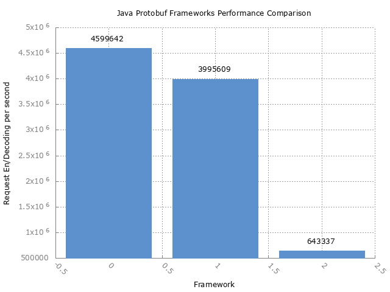

Protobuf Demo with Benchmark
============================

### Libraries

* Protobuf IDL https://developers.google.cn/protocol-buffers/
* Kotlinx.serialization https://github.com/Kotlin/kotlinx.serialization
* protostuff: https://github.com/protostuff/protostuff


### Benchmark
I think some bugs in Kotlin protobuf serialization.

*  Env
```
# JMH version: 1.21
# VM version: JDK 1.8.0_181, Java HotSpot(TM) 64-Bit Server VM, 25.181-b13
# VM invoker: /Library/Java/JavaVirtualMachines/jdk1.8.0_181.jdk/Contents/Home/jre/bin/java
# VM options: -ea -Didea.test.cyclic.buffer.size=1048576 -javaagent:/Users/linux_china/Library/Application Support/JetBrains/Toolbox/apps/IDEA-U/ch-0/183.5429.1/IntelliJ IDEA 2018.3 EAP.app/Contents/lib/idea_rt.jar=61268:/Users/linux_china/Library/Application Support/JetBrains/Toolbox/apps/IDEA-U/ch-0/183.5429.1/IntelliJ IDEA 2018.3 EAP.app/Contents/bin -Dfile.encoding=UTF-8
# Warmup: 1 iterations, 10 s each
# Measurement: 2 iterations, 10 s each
# Timeout: 10 min per iteration
# Threads: 1 thread, will synchronize iterations
# Benchmark mode: Throughput, ops/time
```

* Results: 1: native protobuf, 2: protstuff 3: kotlin protobuf


